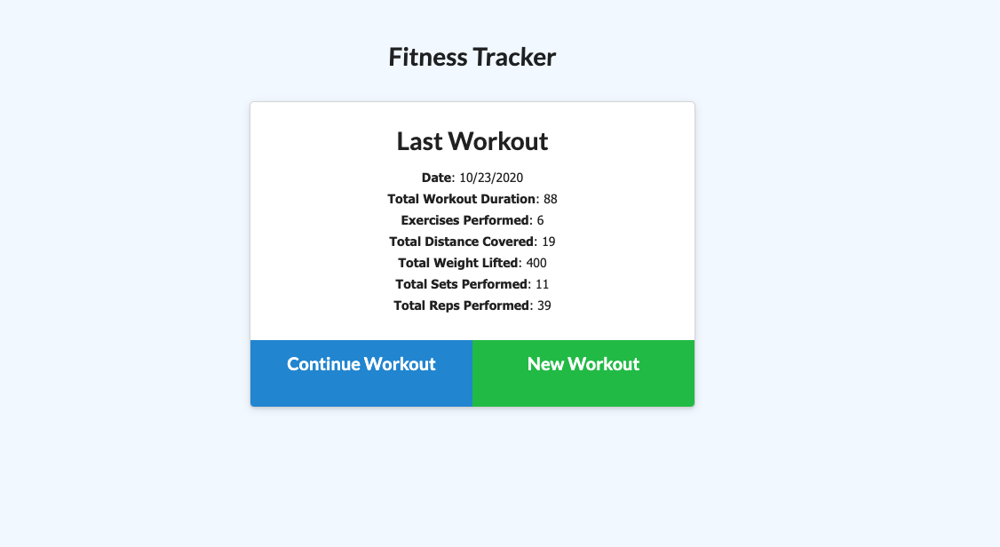

# Workout-Tracker

## Description
A full-stack app that helps with tracking user's workouts and exercises 

## Table of Contents
* [Description](#Description)
* [Usage](#Usage)
* [License](#License)
* [Test](#Tests)
* [Questions](#Questions)

## Usage
Users can track their daily workouts by adding a variety of exercises. Viewing their last workout's exercises and displaying their stats 

## ILicense
MIT

## Testing
Load the deployed app through heroku and start logging your own workouts!

## Questions
- [GitHub](https://github.com/CodyBonsma)
- [Email](codybonsma@gmail.com)